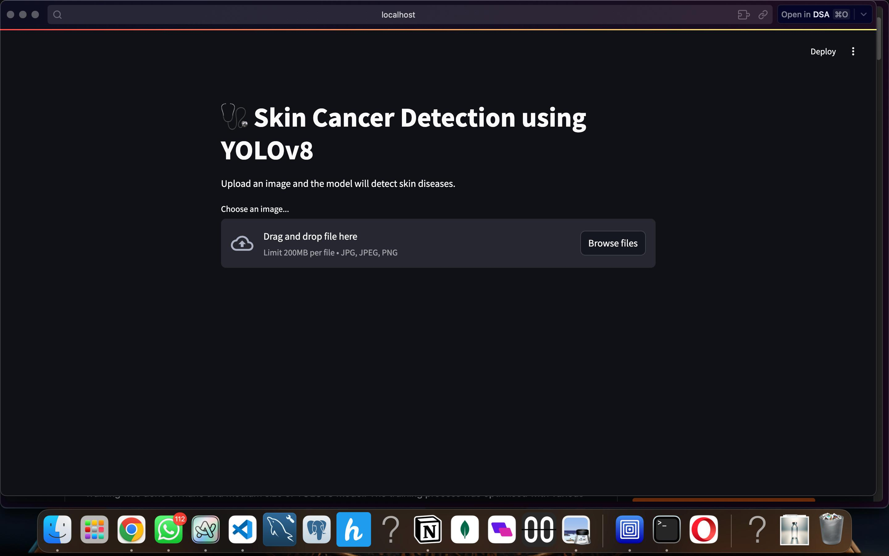
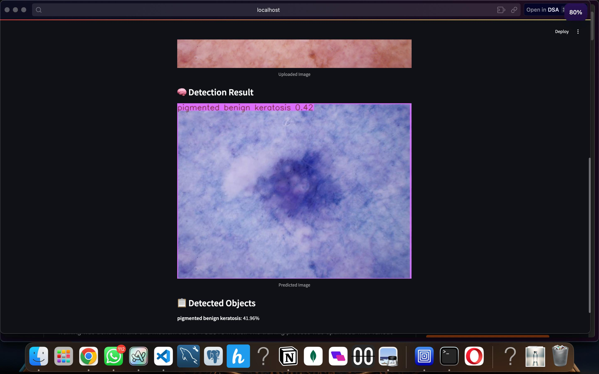
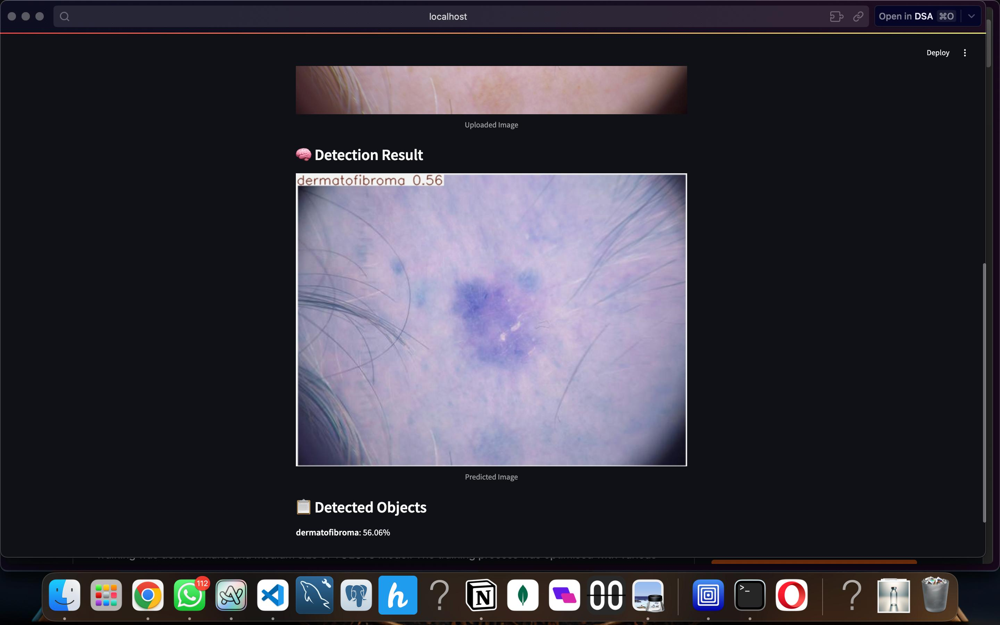

# Skin Cancer Detection with YOLOv8 and Streamlit

This project leverages the YOLOv8 object detection model to identify skin cancer from images. A user-friendly Streamlit web application allows users to upload skin images and receive detection results in real-time.



## 🧠 Project Overview

- **Model**:YOLOv8 trained on a custom skin disease dataset
- **Interface**:Streamlit-based web application for image upload and result visualization
- **Objective**:Provide an accessible tool for preliminary skin cancer detection

## 📁 Repository Structure

- `main.py` Streamlit application scrip.
- `best.pt` Trained YOLOv8 model weight.
- `skin_cancer_detection.ipynb` Jupyter Notebook detailing the model training proces.
- `Webpade_UI.jpg` Screenshot of the application's user interfac.
- `result_2.jpg`, `results_1.jpg` Sample output images showcasing detection result.

## 🚀 Getting Started

### Prerequisites

Ensure you have the following installed:
- Python 3.8 or higer- `pip` package manaer

### Installation

1. **Clone the Repository**:

   ```bash
   git clone https://github.com/vishnuVRmiddela/skin_cancer_detection.git
   cd skin_cancer_detection
   ``


2. **Create a Virtual Environment (Optional but Recommended)**:

   ```bash
   python -m venv venv
   source venv/bin/activate  # On Windows: venv\Scripts\activate
   ``


3. **Install Dependencies**:

   ```bash
   pip install -r requirements.txt
   ``

   *Note: If `requirements.txt` is not present, install the necessary packages manually:*

   ```bash
   pip install ultralytics streamlit opencv-python pillow
   ``

## 🖼️ Usage

1. **Run the Streamlit App**:

   ```bash
   streamlit run main.py
   ``

2. **Interact with the Application**:

  - Navigate to the URL provided by Streamlit (typically `http://localhost:850`).
  - Upload a skin image in JPG, JPEG, or PNG forat.
  - View the detection results displayed on the imge.

## 📊 Sample Resuts





## 📝 Acknowledgmnts

This project is inspired by the need for accessible tools in medical diagnotcs. Special thanks to the developers of YOLOv8 and the contributors to the datasets used for traning.

## 📄 Liense

This project is licensed under the MIT License. See the [LICENSE](LICENSE) file for dtails.
